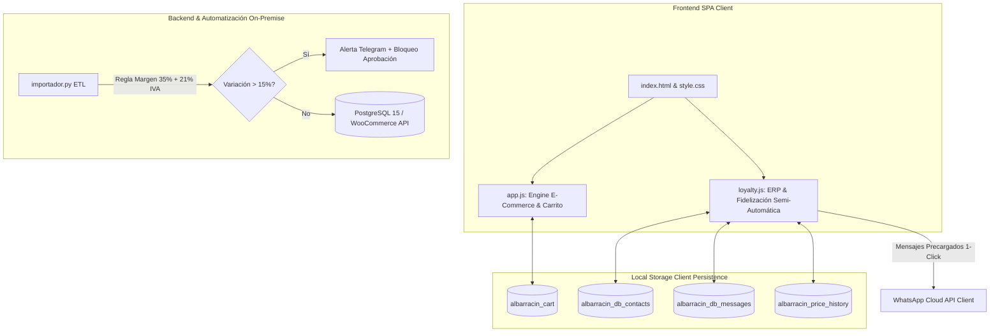

# 📘 Manual del Programador Externo & Arquitectura del Sistema
## Ecommerce, ERP Local & Fidelización Semi-Automática - Albarracín Repuestos

Este documento constituye la guía técnica completa, manual de instrucciones y especificación de arquitectura para **desarrolladores externos**, **administradores de IT** y **programadores backend** encargados de mantener, extender o integrar la plataforma local de **Albarracín Motos y Repuestos**.

---

## 🏗️ 1. Esquema del Código y Arquitectura del Sistema

La solución está estructurada como una **Single Page Application (SPA)** modular de alta velocidad sin dependencias complejas de frontend, conectada a un esquema ERP y ETL local On-Premise.

```
albarracin_repuestos/
├── index.html                           # Estructura principal del DOM (Header, Catálogo, Modal, ERP Modal)
├── style.css                            # Sistema de diseño (Dark/Light mode, Glassmorphism, CSS Variables)
├── app.js                               # Núcleo del E-Commerce (Catálogo, Carrito, Buscador Compatibilidad, WhatsApp)
├── loyalty.js                           # Motor ERP Local, Club de Fidelización, Importador ETL, Precios & Admin
├── loyalty.css                          # Estilos del Panel ERP, Rueda Canvas, Tarjetas Digitales y Tablas
├── mercadolibre.js                      # Módulo Independiente Mercado Libre (OAuth, Stock, Precios, Publicaciones)
├── mercadolibre.css                     # Estilos Módulo Mercado Libre & Acceso Destacado
├── mercadolibre_server.py               # Servidor Backend Python OAuth 2.0 & Webhooks Oficiales
├── schema.sql                           # Esquema DDL SQL para PostgreSQL 15+ (11 Tablas Relacionales)
├── importador.py                        # Script ETL Python 3.11 (Pandas, Cálculo PVP, Alertas Telegram, REST API)
├── docker-compose.yml                   # Orquestación On-Premise (PostgreSQL, WooCommerce, Python ETL, Tunnel)
├── MANUAL_PROGRAMADOR_EXTERNO.md        # Este manual de instrucciones técnicas para desarrolladores
└── paquete_desarrollador_albarracin.zip # Paquete completo de distribución para desarrolladores
```

### 📊 Diagrama de Flujo de Datos & Componentes



---

## 🗄️ 2. Modelo de Datos Relacional (PostgreSQL 15+)

El sistema cuenta con un esquema de base de datos relacional documentado en [`schema.sql`](file:///d:/SEBASTIAN/IA_desarrollos/comp2/albarracin_repuestos/schema.sql):

1. **`productos`**: Catálogo maestro (`id`, `sku`, `marca`, `nombre`, `costo_proveedor`, `pvp_final`, `stock_real`, `stock_minimo`).
2. **`historial_precios`**: Trazabilidad completa de auditoría de costos y PVPs (`costo_anterior`, `costo_nuevo`, `pvp_anterior`, `pvp_nuevo`, `variacion_porcentaje`, `estado_aprobacion`).
3. **`compatibilidad_vehiculos`**: Asociación de repuestos con marcas, modelos y rango de años (`marca_auto`, `modelo`, `anio_inicio`, `anio_fin`).
4. **`cross_selling_rules`**: Reglas de venta cruzada (`producto_principal_id`, `producto_sugerido_id`, `tipo`, `descuento_porcentaje`).
5. **`club_beneficios_puntos`**: Sistema de fidelización y mecánicos afiliados (`puntos_acumulados`, `nivel`, `codigo_afiliado_mecanico`, `repuestopesos_acumulados`).
6. **`recompra_programada`**: Mantenimiento preventivo automatizado (`cliente_id`, `producto_id`, `dias_intervalo_recompra`, `estado`).

---

## ⚙️ 3. Guía de Extensión para Programadores Externos

### A. Conectar a una API REST Externa (Reemplazar Mock Data)
Para conectar el frontend a un servidor Node.js, Python FastAPI o PHP real en lugar de la variable local `PRODUCTS_DATA`, modifique en `app.js` la inicialización del catálogo:

```javascript
// app.js - Conexión API Externa
async function fetchCatalogFromAPI() {
  try {
    const response = await fetch('https://api.tuempresa.com/v1/productos');
    const data = await response.json();
    
    // Mapear productos
    window.PRODUCTS_DATA = data.map(item => ({
      id: item.id,
      name: item.nombre,
      brand: item.marca,
      category: item.categoria,
      subcategory: item.subcategoria,
      price: item.pvp_final,
      img: item.imagen_url || 'assets/repuesto_placeholder.jpg',
      desc: item.descripcion,
      specs: item.especificaciones,
      compatibilities: item.compatibilidades || []
    }));
    
    renderCatalog();
  } catch (error) {
    console.error('Error al conectar con la API externa:', error);
  }
}
```

### B. Modificar las Reglas de Precios (Margen e IVA)
Para ajustar los márgenes comerciales o impuestos en la importación de precios:

1. **En Python (`importador.py`):**
   ```python
   MARGEN_GANANCIA = 0.35  # Ajustar porcentaje de margen (ej: 0.40 para 40%)
   IVA_ARGENTINA = 0.21    # Ajustar tasa de IVA (ej: 0.21 para 21%)
   UMBRAL_VARIACION_ALERTA = 0.15 # 15% umbral para disparo de Telegram
   ```

2. **En el Frontend (`loyalty.js`):**
   ```javascript
   // Cálculo de PVP en el cliente
   const pvpNuevo = Math.round((costoNuevo * 1.35) * 1.21);
   ```

---

## 🚀 4. Guía de Despliegue On-Premise (Docker & Cloudflare Tunnel)

### Requisitos Previos:
- Servidor local con Docker Engine y Docker Compose instalado.
- Cuenta gratuita en Cloudflare para generar un Tunnel SSL `$0`.

### Pasos de Despliegue:
1. Clonar o descomprimir `paquete_desarrollador_albarracin.zip` en el servidor local.
2. Ejecutar la inicialización de contenedores:
   ```bash
   docker-compose up -d
   ```
3. Verificar el estado de los servicios:
   - PostgreSQL 15: `localhost:5432`
   - Storefront / ERP Web: `http://localhost:8080`
   - Python ETL Runner: Ejecución automatizada vía cron.

---

## 🛠️ 5. Manual de Operación del Módulo de Fidelización & ERP

1. **Acceso al Panel ERP:**
   - Hacer clic en el icono de engranaje (`⚙`) en la cabecera del panel del Club o en el botón **`Club 🎁`** del header.
   - Contraseña de acceso por defecto: **`admin`**.

2. **Operación de Funciones:**
   - **Importar Listas ETL:** Subir listas CSV/JSON en la pestaña `📥 Importar Listas ETL`.
   - **Aprobar Precios:** En `📊 Historial Precios`, aprobar items cuya variación superó el 15%.
   - **Exportar / Restaurar Backup:** En `🎁 Fidelización Semi-Aut.`, usar los botones de exportación e importación de archivos `.json` de respaldo completo.
   - **Acciones WhatsApp 1-Click:** Utilizar los botones `💬 Enviar Saldo & Cupón` y `🔧 Recordatorio Recompra` para disparar chats a clientes.

---

## 📄 Licencia & Soporte Técnico
Desarrollado para **Albarracín - Motos y Repuestos**. Código modular sin dependencias de terceros ni tarifas de licencia mensuales.
